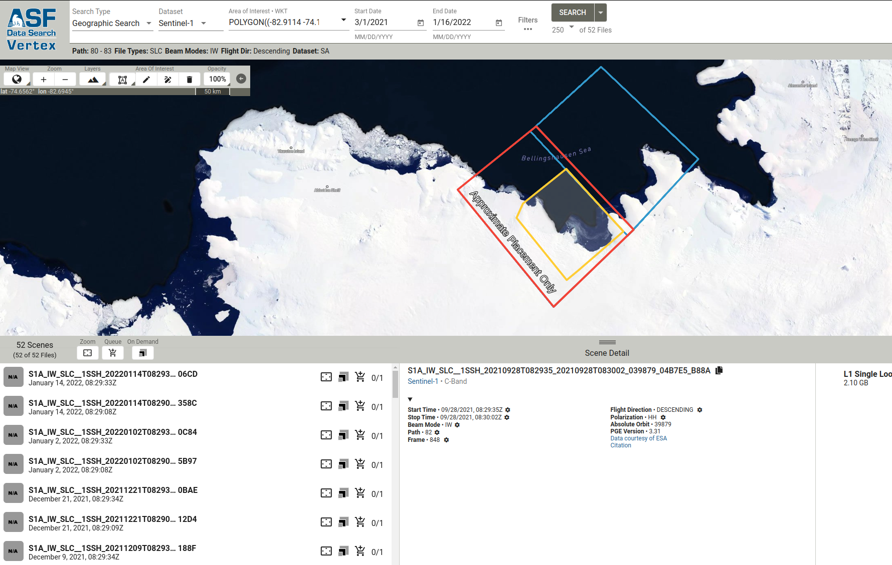
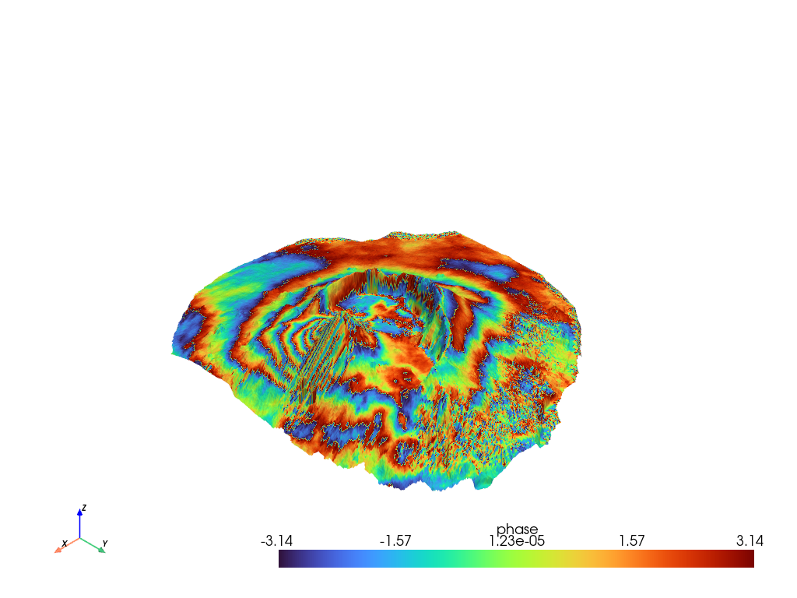
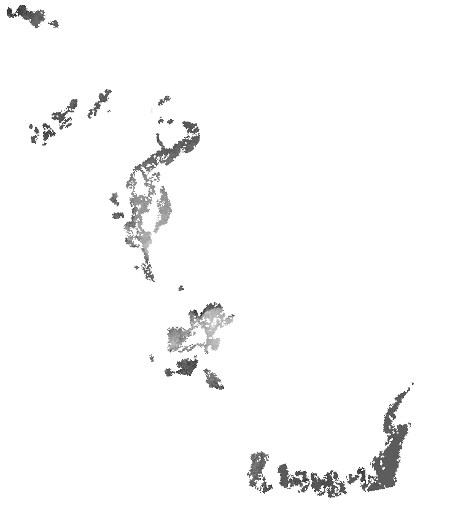

# ARSI Radar Remote Sensing - Interferometry

## To run this you need Docker. Otherwise the installation of the dependencies is a bit tricky.

[](https://docs.docker.com/engine/install/)

```bash
docker run -v ./notebooks:/home/jovyan/notebooks -it -dp 8888:8888 -dp 8787:8787 --restart always --name pygmtsar docker.io/pechnikov/pygmtsar 

```

```bash
docker run -v /home/christian/hnee/playground/gmtsar/notebooks:/home/jovyan/notebooks -it -dp 8888:8888 -dp 8787:8787 --restart always --name pygmtsar docker.io/pechnikov/pygmtsar 
```


Coverage of the ASF data


Interferogram of the Pico do Fogo volcano eruption 2014


Unsucessfull mapping of the Twhaites Glacier.



To stop and remove the container:
```bash
docker stop pygmtsar

docker rm pygmtsar
```