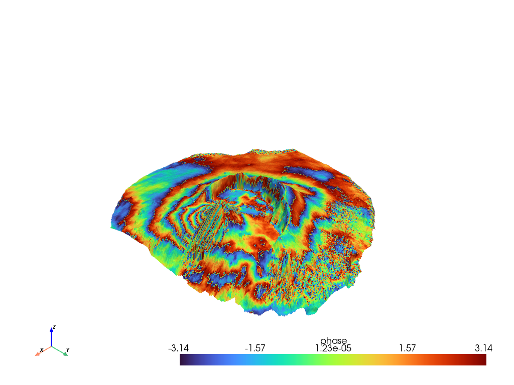

# ARSI Radar Remote Sensing - Interferometry

## To run this you need Docker. Otherwise the installation of the dependencies is a bit tricky.

[Install Docker](https://docs.docker.com/engine/install/)

Start the container with the following command:
```bash
docker run -v ./notebooks:/home/jovyan/notebooks -it -dp 8888:8888 -dp 8787:8787 --restart always --name pygmtsar docker.io/pechnikov/pygmtsar 
```

Get the token from the logs:
```bash
docker logs pygmtsar
```

Now you can open the Jupyter Notebook in your browser and open the Notebook Christian_Winkelmann_RSCDP.ipynb or the third party notebooks:
- hyp3_insar_stack_for_ts_analysis.ipynb (Hyp3 example)
- Pico_do_Fogo_Volcano_Eruption_2014.ipynb (GMTSar example)
- sdk_example.ipynb (ASF API and Auto-RIFT example)

Coverage of the ASF data


Interferogram of the Pico do Fogo volcano eruption 2014


Unsucessfull mapping of the Twhaites Glacier.


To stop and remove the container:
```bash
docker stop pygmtsar

docker rm pygmtsar
```